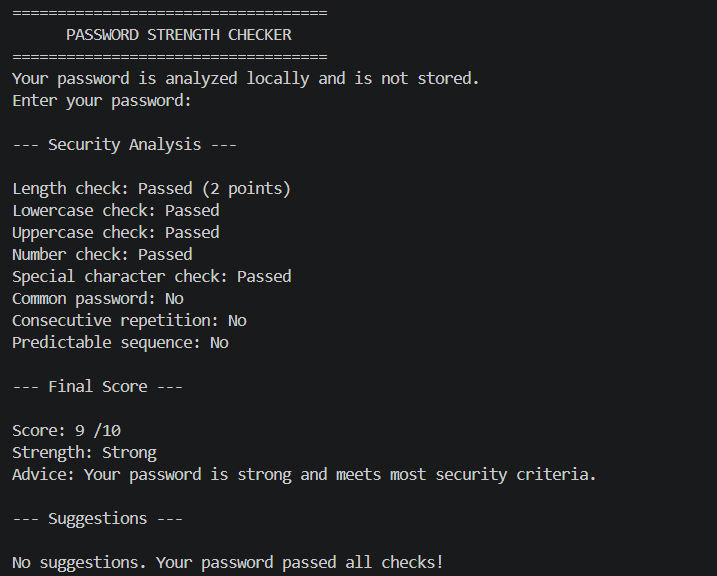

# 🔐 Password Strength Checker

A Python-based cybersecurity tool that evaluates password strength using multiple security criteria and provides suggestions for improvement.

## ✨ Features

- Password length & character checks
- Common password detection
- Repetition & predictable sequence detection
- Strength score out of 10
- Weak / Moderate / Strong rating
- Security improvement suggestions
- Password is not stored or transmitted

## 🛠️ Technologies

- Python 3
- `getpass`
- `string`
- VS Code

## ⚙️ How It Works

```text
Enter Password
      ↓
Validate Input
      ↓
Analyze Security Criteria
      ↓
Calculate Score
      ↓
Determine Strength
      ↓
Display Suggestions
```

## 🧪 Demo

  # Screenshot



```text
--- Security Analysis ---

Length check: Passed
Lowercase check: Passed
Uppercase check: Passed
Number check: Passed
Special character check: Passed
Common password: No
Predictable sequence: No

--- Final Score ---

Score: 8 /10
Strength: Strong
```

## ⚠️ Limitations

This project uses a custom educational scoring system and a limited list of common passwords. It does not check real-time data breaches or guarantee that a password is impossible to crack.

## 🚀 Future Improvements

- Larger common-password database
- Improved pattern detection
- Entropy-based analysis
- Secure password generator
- GUI / web version

## 💻 How to Run

```bash
python password_checker.py
```